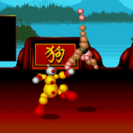

CSci-4611 Assignment 4: So You Think Clowns Can Dance

Keyboard Interface for Program:

Motions 1 through 5:
    Press Keypad buttons 1 through 5 to initiate.

Start the Dance Party:
    Press Space.

End the Dance Party:
    Press Space again.

Exit the Program:
    Escape.

Clown design based on character Boomer from game Ballz.

Image taken from: https://emulatoronline.com/sega-games/ballz-3d-fighting-at-its-ballziest/
